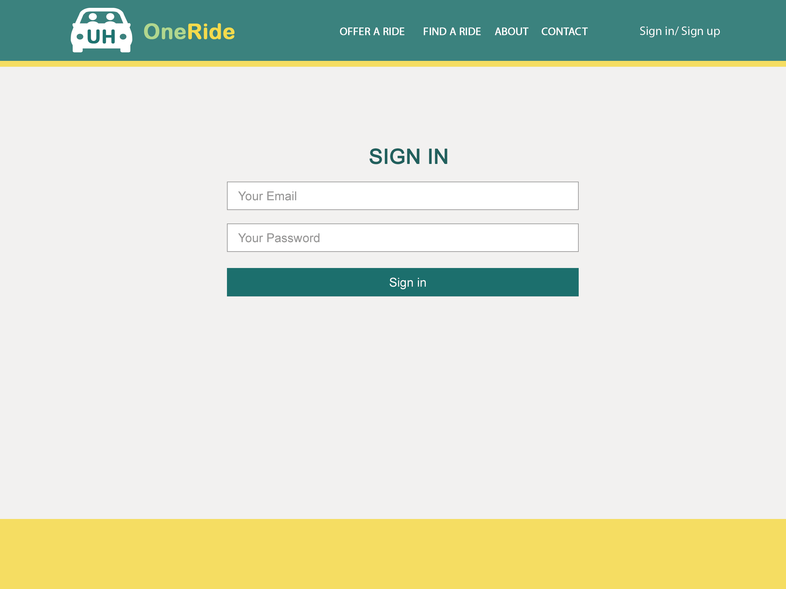
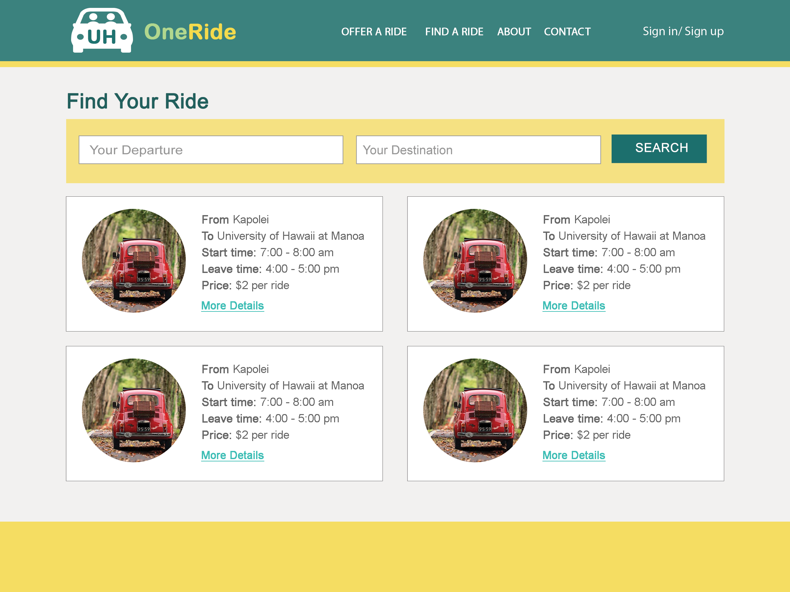
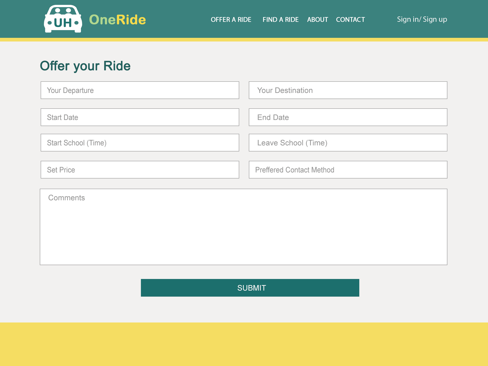
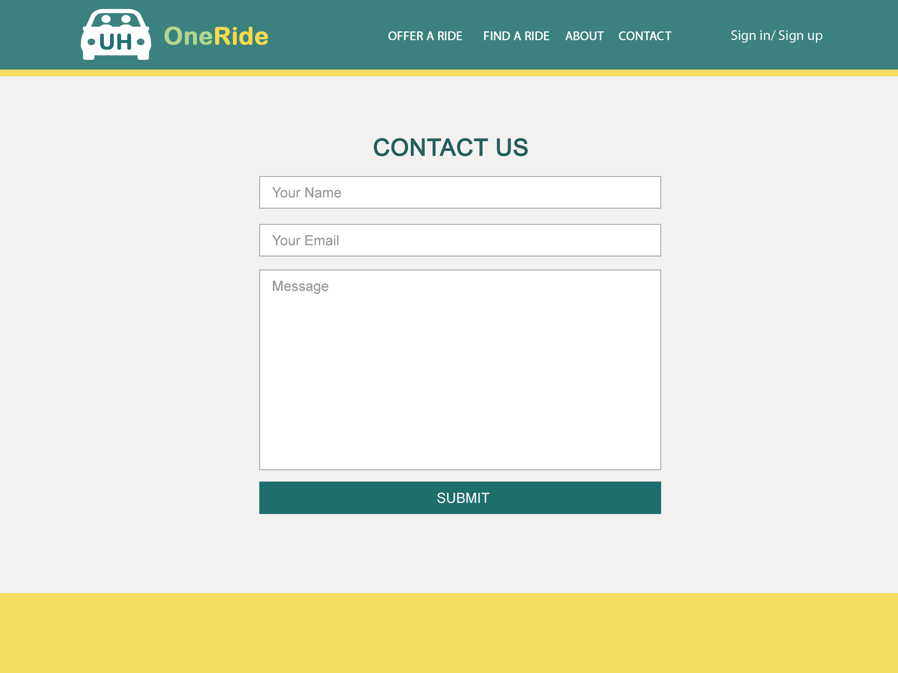

With Hawaii’s traffic being the second worst in the nation and limited parking space on UH campus, it can be very difficult to get onto campus via car. Sure there’s rideshare programs like Uber and Lyft, but for some it can feel unsafe; riding with strangers who you know nothing about. Not to mention the environmental impact caused by all the cars going to and from just for a single student, there must be a better solution to this. Of course there is : carpooling is a great solution to these problems. 

UH OneRide provides a solution to those looking for a transportation alternative, offering conveinence, safety, and a great opportunity to socialize with like people. Be a Rider, Driver, or both and easily coordinate carpools for everyday classes, or one-time special event. Our service is exclusive to members of the UH system; students, faculty, staff from all campuses can participate! 

## How It Works 
First you must sign up with a valid hawaii.edu email account. Provide a name, profile image, location in which you wish to be picked up from, and some personal information like hobbies, interests, major etc.

By default everyone is a Rider, and can view a list of all drivers in the system. Each Driver would be represented by a card, with images, personal information, where they come from and what time, and other members of the carpool, as well as any pricing. If you find a Driver that matches your preferences, you can contact them via their UH emails.

You can request to be a Driver by providing additional information upon sign up or at a later date, like car identifiers and an image of the driver's license. After review by a site admin, your application will be either approved/denied. As a Driver, you can add/remove Riders from your carpool.

If you have an issue with another user or find a bug in our system, you can fill out a form. A site admin will review the form and act accordingly. 

## Development and Progress
### Milestone 1 (Due Nov 21)

__*WIP*__

### Milestone 2 (Due Dec 5)

__*WIP*__

### Milestone 3 (Due Dec 12)

__*WIP*__
