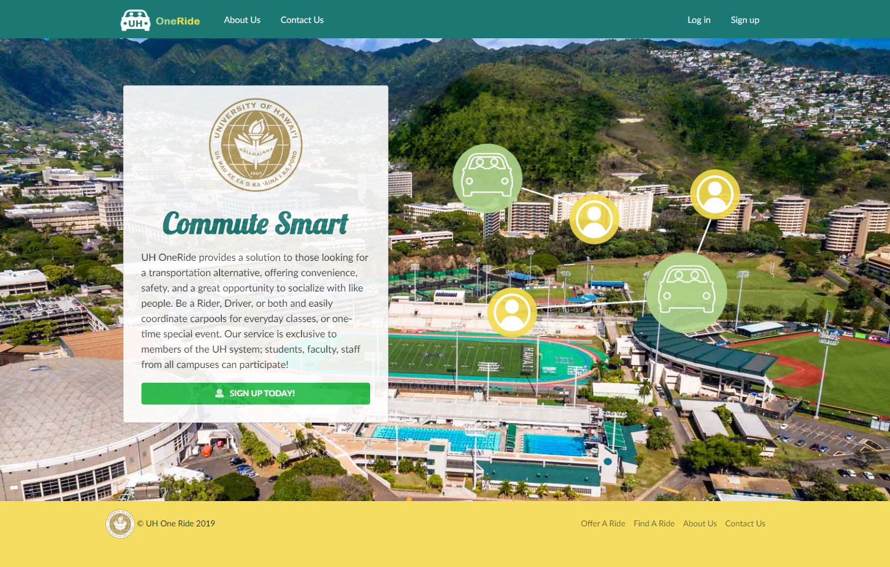
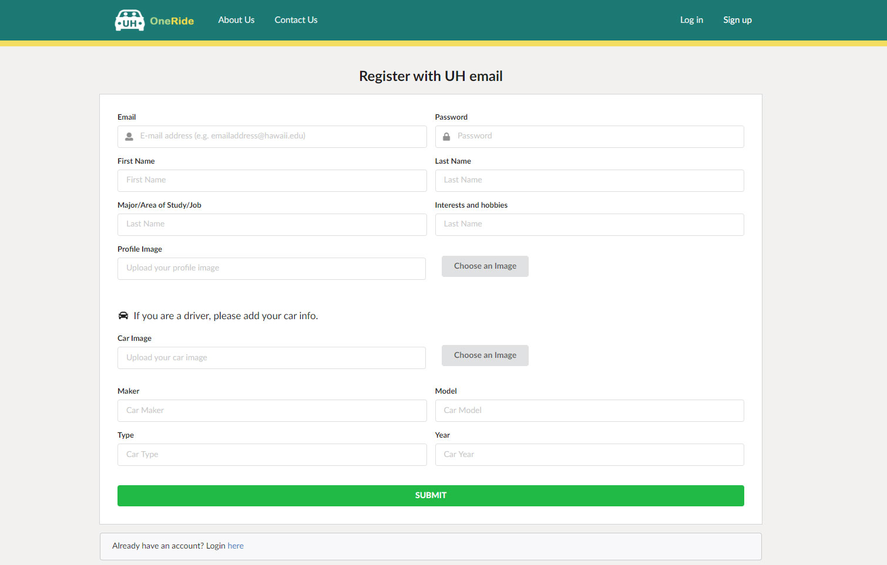
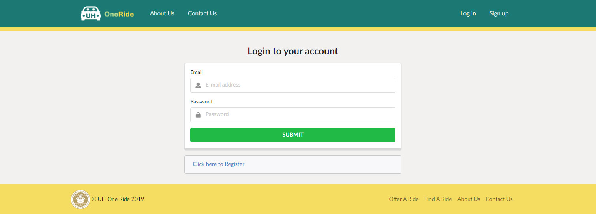
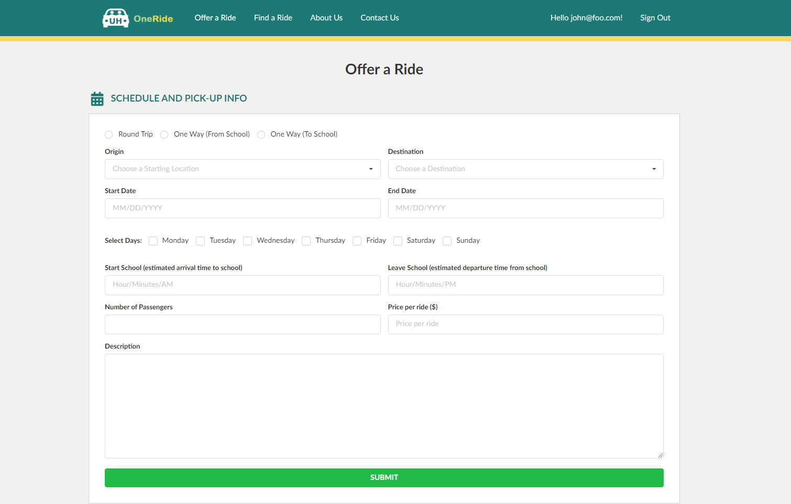
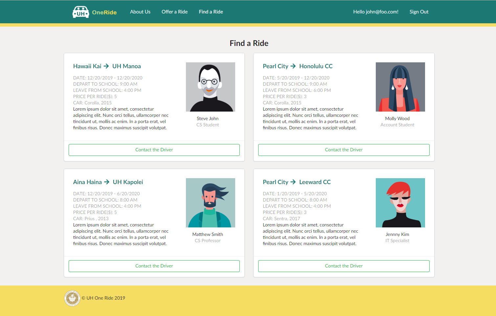
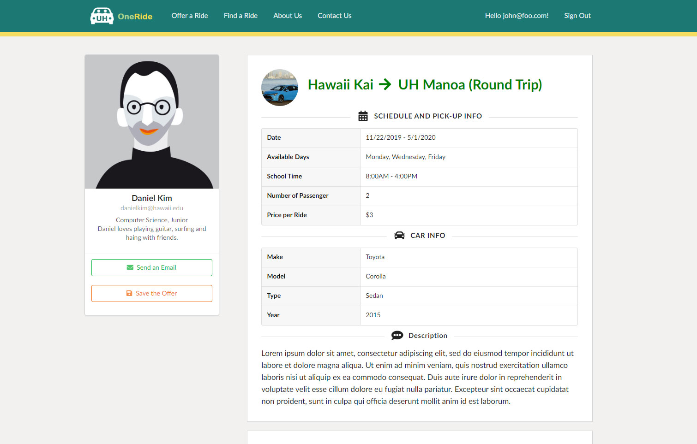

## UH OneRide "Commute Smart"

* [Look at our code!] (https://github.com/UH-OneRide/uh-oneride)
* [View the website!] (http://uh-oneride.meteorapp.com/)

## Table of Contents

* [Goals](#goals)
* [Overview](#overview)
* [Project Pages](#project-pages)
* [User Guide](#user-guide)
* [Developer Guide](#developer-guide)
* [Community Feedback](#community-feedback)
* [Development and Progress](#development-and-progress)
* [Contributors](#contributors)

## GOALS
* To let UH community know that great impact of carpooling and motivate them using the website
* To drive more traffic to the website 
* To increase sign-in users
* To keep an up-to-date “Offer a Ride” list 

## OVERVIEW
With Hawaii’s traffic being the second worst in the nation and limited parking space on UH campus, it can be very difficult to get onto campus via car. Sure there’s rideshare programs like Uber and Lyft, but for some it can feel unsafe; riding with strangers who you know nothing about. Not to mention the environmental impact caused by all the cars going to and from just for a single student, there must be a better solution to this. Of course there is : carpooling is a great solution to these problems. 

UH OneRide provides a solution to those looking for a transportation alternative, offering conveinence, safety, and a great opportunity to socialize with like people. Be a Rider, Driver, or both and easily coordinate carpools for everyday classes, or one-time special event. Our service is exclusive to members of the UH system; students, faculty, staff from all campuses can participate! 

## USER GUIDE 

### Landing Page
On the homepage, a blurb explains users what the website is for and how it works. 

### Register Page

First you must sign up with a valid hawaii.edu email account. Provide a name, profile image, location in which you wish to be picked up from, and some personal information like hobbies, interests, major etc.

### Member Profile
Once you've signed up, you can view and edit your profile. The profile contains your personal info, car info and your offers.

### Login Page
You need email and password to login.

### Offer a Ride
After login, all users can list their offers on the website. 

### Find a Ride
By default everyone is a Rider, and can view a list of all drivers in the system. Each Driver would be represented by a card, with images, personal information, where they come from and what time, and other members of the carpool, as well as any pricing. If you click the "Detail" button, you can see more detail information about the carpool.

### Driver Profile

If you find a Driver that matches your preferences, you can contact them via their UH emails. You can request to be a Driver by providing additional information upon sign up or at a later date, like car identifiers and an image of the driver's license. After review by a site admin, your application will be either approved/denied. As a Driver, you can add/remove Riders from your carpool.

### About Us
The "About Us" page give users more insight into who is involved and what it does. 

### Contact Us
If you have an issue with another user or find a bug in our system, you can fill out a form. A site admin will review the form and act accordingly. 

## DEVELOPER GUIDE

## DEVELOPMENT AND PROGRESS 

### Milestone 1 (Due Nov 21)

Milestone 1 is the only milestone where we have specific goals. We are to complete the landing page and mockups of at least 4 other pages. Our goal for next milestone is to have a completely functional, but not fully featured, website! The experience delivered by our website should be very similar to what it would be upon release. This includes writing User Reviews, editing their Profiles and ride Offers, and for admins to view and address Contact Forms.

[See our GitHub project board for Milestone 1 here!](https://github.com/UH-OneRide/uh-oneride/projects/1)

### Milestone 2 (Due Dec 5)

[See our GitHub project board for Milestone 2 here!](https://github.com/UH-OneRide/uh-oneride/projects/2)

### Milestone 3 (Due Dec 12)
[See our GitHub project board for Milestone 2 here!](https://github.com/UH-OneRide/uh-oneride/projects/3)

## Contributors

* [Hanna Park](#https://hannaparkUH.github.io/)
* [Kayla Kwock](#https://kayla-kwock.github.io/)

