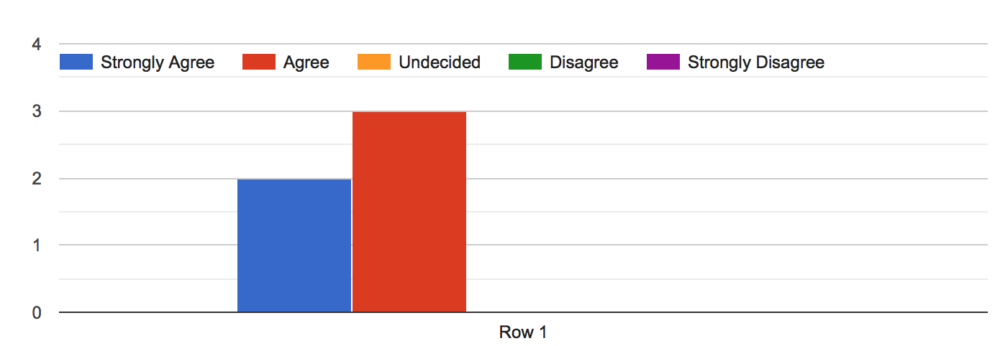

## UH OneRide "Commute Smart"

* [Look at our code!](https://github.com/UH-OneRide/uh-oneride)
* [View the website!](http://uh-oneride.meteorapp.com/)

## Table of Contents

* [Goals](#goals)
* [Overview](#overview)
* [User Guide](#user-guide)
* [Community Feedback](#community-feedback)
* [Developer Guide](#developer-guide)
* [Development History](#development-history)
* [Contributors](#contributors)

## GOALS
* To let UH community know that great impact of carpooling and motivate them using the website
* To drive more traffic to the website 
* To increase sign-in users
* To keep an up-to-date “Offer a Ride” list 

## OVERVIEW
With Hawaii’s traffic being the second worst in the nation and limited parking space on UH campus, it can be very difficult to get onto campus via car. Sure there’s rideshare programs like Uber and Lyft, but for some it can feel unsafe; riding with strangers who you know nothing about. Not to mention the environmental impact caused by all the cars going to and from just for a single student, there must be a better solution to this. Of course there is : carpooling is a great solution to these problems. 

UH OneRide provides a solution to those looking for a transportation alternative, offering conveinence, safety, and a great opportunity to socialize with like people. Be a Rider, Driver, or both and easily coordinate carpools for everyday classes, or one-time special event. Our service is exclusive to members of the UH system; students, faculty, staff from all campuses can participate! 

## USER GUIDE 

### Landing Page
On the homepage, a blurb explains users what the website is for and how it works. 


### Register Page
First you must sign up with a valid hawaii.edu email account. Provide a name, profile image, location in which you wish to be picked up from, and some personal information like hobbies, interests, major etc.


### Member Profile
Once you've signed up, you can view and edit your profile. The profile contains your personal info, car info and your offers.


### Login Page
You need email and password to login.


### Offer a Ride
After login, all users can list their offers on the website. 


### Find a Ride
By default everyone is a Rider, and can view a list of all drivers in the system. Each Driver would be represented by a card, with images, personal information, where they come from and what time, and other members of the carpool, as well as any pricing. If you click the "Detail" button, you can see more detail information about the carpool.


### Driver Profile
If you find a Driver that matches your preferences, you can contact them via their UH emails. You can request to be a Driver by providing additional information upon sign up or at a later date, like car identifiers and an image of the driver's license. After review by a site admin, your application will be either approved/denied. As a Driver, you can add/remove Riders from your carpool.


### About Us
The "About Us" page give users more insight into who is involved and what it does. 


### Contact Us
If you have an issue with another user or find a bug in our system, you can fill out a form. A site admin will review the form and act accordingly. 


## COMMUNITY FEEDBACK
We sent [Google Survey Form](https://docs.google.com/forms/d/e/1FAIpQLScAHQq5YTv33E_0I0fZ_MuoOXnZHZy3ONNuC79tu19OX0QL4g/viewform) to 5 members of UH community and asked 6 questions. Here is the result of the survey.

### 1. What is your first impression of the site?

*"I love the idea! I wish this site was up and working for UH now. The UH community is in dire need of something like this to alleviate congestion, financial burden on students, and for environmental reasons. I drive to work in the mornings and see people waiting at the bus stop. I would be happy to give people rides if I knew they were going to UH, knew I could drop them off where I park or nearby, and had a similar time schedule."*

*"Simple and clean design. Great use of color and images to make it visually interesting :)"*

*"Modern look, not too crowded, easy to navigate through, and descriptive with explaining the purpose of the site."*

*"clean design with nice colors, easy to navigate."*

### 2. What is your biggest concern of the site?

*"I would want to have drivers be reviewed by other riders, and vice versa, for safety. When I tried to hit the "find a ride" link the site kept cycling saying "getting data.""*

*"When clicking the "Contact the Driver" buttons, nothing seems to happen."*

*"Not sure if there is a fee required to be a rider or a driver. If it's free, maybe say that on the front page?"*

### 3. If you could change one thing about this website, what would it be?

*"Having highly reviewed drivers you can see and reach out to, to ask if they are willing to be your driver for your commute. The ability to see drivers or riders in your nearby area (a list within one mile, or a zone circle) to car share with for geographic convenience."*

*"On the Offer page, add indicators for required fields. Each time I submitted, it would tell me only one of the fields I was missing, so I had to try submitting multiple times before I finally got all of the required fields filled out. It would be easier to know which ones I was missing if the required fields were marked."*

*"Adding a page where it the user can view the rides they submitted, and possibly adding other features like driver ratings."*

*"I would change the picture on the front page. The current picture is a picture of the sports field, which makes me a bit confused at the beginning to relate it to the ride service. It's also not places where you can drop off or pick up people. I would recommend to change to a picture of the main campus and have the signs (people and cars) located on actual places where people can drop off or get on a car."*

### 4. Did you find the site easy to navigate?


### 5. Did the site give you all the relevant information needed?



### 6. Would you visit the site again and recommend this site to a friend?


## DEVELOPER GUIDE
First, [install Meteor](https://www.meteor.com/install).

Second, go to [https://github.com/UH-OneRide/uh-oneride](https://github.com/UH-OneRide/uh-oneride), and click the "Use this template" button. Complete the dialog box to create a new repository that you own that is initialized with this template's files.

Then, cd into the app/ directory of your local copy of the repo, and install third party libraries with:

```
$ meteor npm install
```

Once the libraries are installed, you can run the application by invoking the "start" script.

```
$ meteor npm run start
```

Finally, you will be able to see the application at [http://localhost:3000](http://localhost:3000)


## DEVELOPMENT HISTORY 


### Milestone 1 (Due Nov 21)

First, we create a GitHub organization and implement Issue driven project management (IDPM). After completing the landing page and mockups of at least 4 other pages, deploy our system to Galaxy.

[See our GitHub project board for Milestone 1 here!](https://github.com/UH-OneRide/uh-oneride/projects/1)

### Milestone 2 (Due Dec 5)
Our goal for Milestone 2 is to have a completely functional, but not fully featured, website! The experience delivered by our website should be very similar to what it would be upon release. This includes writing User Reviews, editing their Profiles and ride Offers, and for admins to view and address Contact Forms.

[See our GitHub project board for Milestone 2 here!](https://github.com/UH-OneRide/uh-oneride/projects/2)

### Milestone 3 (Due Dec 17)
Our goal for Milestone 3 is to improve the functionality of our system from Milestone M2, fix bugs and clean-up files.  Our team’s GitHub Page needs to be updated for the current version of our system following GitHub hosting guidelines. Finally, we will contact five UH community members to try out our system and get feedback.

[See our GitHub project board for Milestone 2 here!](https://github.com/UH-OneRide/uh-oneride/projects/3)

## Contributors

* [Hanna Park](https://hannaparkUH.github.io/)
* [Kayla Kwock](https://kayla-kwock.github.io/)


