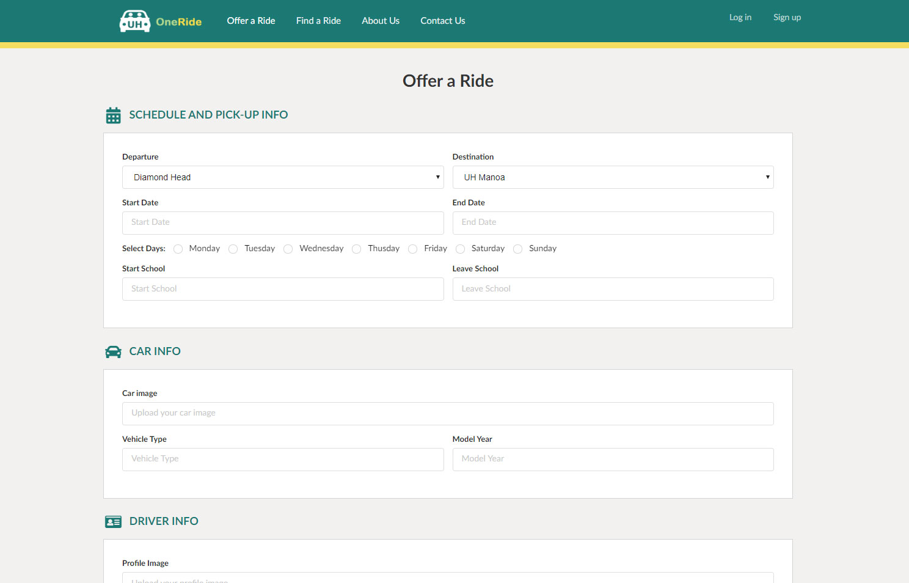

With Hawaii’s traffic being the second worst in the nation and limited parking space on UH campus, it can be very difficult to get onto campus via car. Sure there’s rideshare programs like Uber and Lyft, but for some it can feel unsafe; riding with strangers who you know nothing about. Not to mention the environmental impact caused by all the cars going to and from just for a single student, there must be a better solution to this. Of course there is : carpooling is a great solution to these problems. 

UH OneRide provides a solution to those looking for a transportation alternative, offering conveinence, safety, and a great opportunity to socialize with like people. Be a Rider, Driver, or both and easily coordinate carpools for everyday classes, or one-time special event. Our service is exclusive to members of the UH system; students, faculty, staff from all campuses can participate! 

[Look at our code!](https://github.com/UH-OneRide/uh-oneride)
[View the Website!](http://uh-oneride.meteorapp.com/)

## How It Works 
First you must sign up with a valid hawaii.edu email account. Provide a name, profile image, location in which you wish to be picked up from, and some personal information like hobbies, interests, major etc.

By default everyone is a Rider, and can view a list of all drivers in the system. Each Driver would be represented by a card, with images, personal information, where they come from and what time, and other members of the carpool, as well as any pricing. If you find a Driver that matches your preferences, you can contact them via their UH emails.

You can request to be a Driver by providing additional information upon sign up or at a later date, like car identifiers and an image of the driver's license. After review by a site admin, your application will be either approved/denied. As a Driver, you can add/remove Riders from your carpool.

If you have an issue with another user or find a bug in our system, you can fill out a form. A site admin will review the form and act accordingly. 

## Development and Progress
### Milestone 1 (Due Nov 21)

Milestone 1 is the only milestone where we have specific goals. We are to complete the landing page and mockups of at least 4 other pages. 

The Offer Page is where a User goes to post a ride offer. Currently a user can post information for a one-way trip.

The Find Page is where Users can search through the Offers. So far, this feature is fairly lacking, as there is no way to get the contact information of the Driver. 

The Contact Page is where a User can fill out a Contact Form to talk to one of the admins about a rider complaint or bug.

Our goal for next milestone is to have a completely functional, but not fully featured, website! The experience delivered by our website should be very similar to what it would be upon release. This includes writing User Reviews, editing their Profiles and ride Offers, and for admins to view and address Contact Forms.

[See our GitHub project board for Milestone 1 here!](https://github.com/UH-OneRide/uh-oneride/projects/1)

### Milestone 2 (Due Dec 5)

__*WIP*__

[See our GitHub project board for Milestone 2 here!](https://github.com/UH-OneRide/uh-oneride/projects/2)

### Milestone 3 (Due Dec 12)

__*WIP*__
